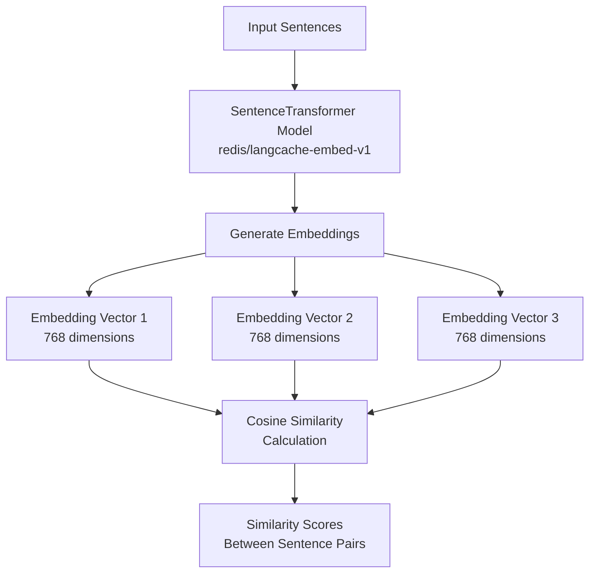

# Sentence Similarity using SentenceTransformer

This example demonstrates how to use the SentenceTransformer library to compute sentence embeddings and calculate similarity between sentences.

## Flow Diagram



## Prerequisites

- Python 3.7+
- Required Python packages (install using `pip install -r requirements.txt`)

## Usage

1. Install the required dependencies:
   ```bash
   pip install -r requirements.txt
   ```
2. Run the script:
   ```bash
   python sentence_similarity.py
   ```

## What it does

1. Loads the SentenceTransformer model from HuggingFace Hub
2. Takes input sentences and generates embeddings directly
3. Calculates cosine similarity between pairs of sentences
4. Prints the similarity scores

The example demonstrates how easy it is to use the SentenceTransformer library for semantic similarity tasks. 