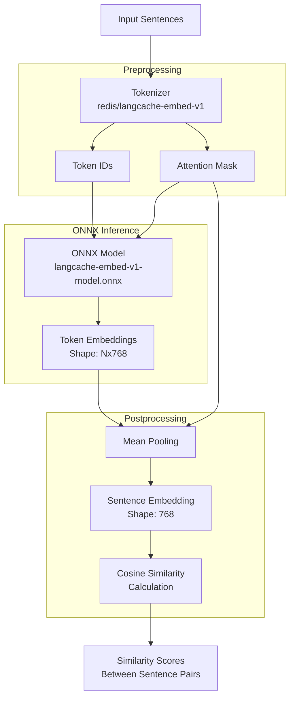

# Sentence Similarity using ONNX

This example demonstrates how to use an ONNX model for computing sentence embeddings and calculating similarity between sentences. It uses the same model as example 02 but runs inference using ONNX Runtime for improved performance.

## Flow Diagram



## Prerequisites

- Python 3.7+
- ONNX model file (`langcache-embed-v1-model.onnx`) in the parent directory
  - You can download the model from [Hugging Face](https://huggingface.co/redis/langcache-embed-v1)
  - Look for the ONNX file in the "Files and versions" tab
- Required Python packages (install using `uv pip install -r requirements.txt`)

## Setup

1. Install the required dependencies:
```bash
uv pip install -r requirements.txt
```

2. Run the example:
```bash
uv run sentence_similarity_onnx.py
```

## What it does

1. Loads the ONNX model and tokenizer
2. For each input sentence:
   - Tokenizes the text using HuggingFace tokenizer
   - Runs inference through ONNX Runtime
   - Applies mean pooling to get sentence embeddings
3. Calculates cosine similarity between pairs of sentences
4. Prints the similarity scores

The example uses the same sentences as the non-ONNX version for easy comparison of results, but with potentially better performance through ONNX Runtime optimization. 