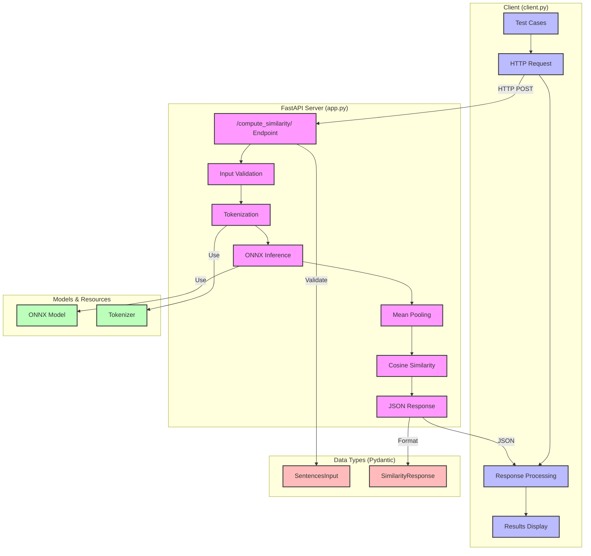

# Architecture Diagram

## Flow Description

1. **Client Side (client.py)**
   - Prepares test cases with different sentences
   - Sends HTTP POST requests to the server
   - Processes and displays the response

2. **Server Side (app.py)**
   - FastAPI endpoint receives POST request
   - Validates input using Pydantic models
   - Processes sentences through the pipeline:
     * Tokenization
     * ONNX model inference
     * Mean pooling
     * Cosine similarity calculation
   - Returns JSON response

3. **Models & Resources**
   - ONNX model for sentence embeddings
   - Tokenizer for text preprocessing

4. **Data Types**
   - SentencesInput: Validates incoming requests
   - SimilarityResponse: Structures the response

## Technical Details

- **Server Port**: 8000
- **Endpoint**: /compute_similarity/
- **Request Format**: JSON with list of sentences
- **Response Format**: JSON with embeddings and similarities
- **Model Location**: Parent directory (../langcache-embed-v1-model.onnx) 